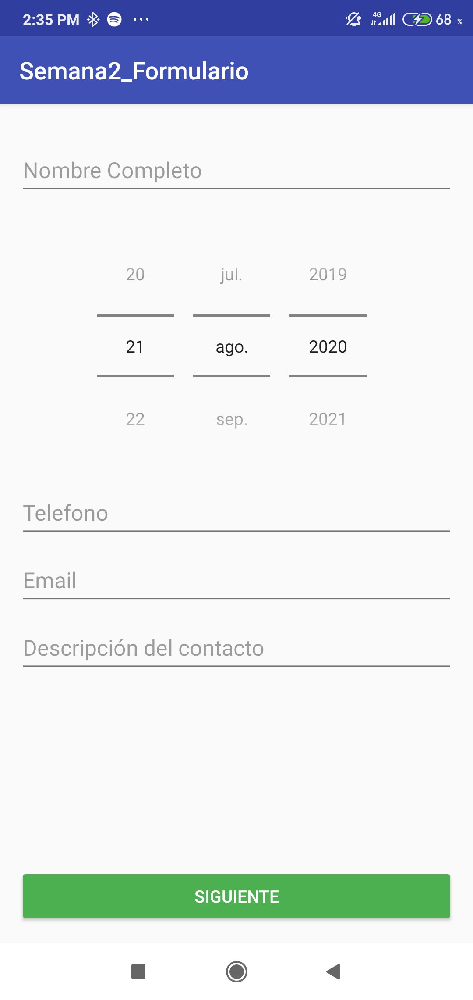
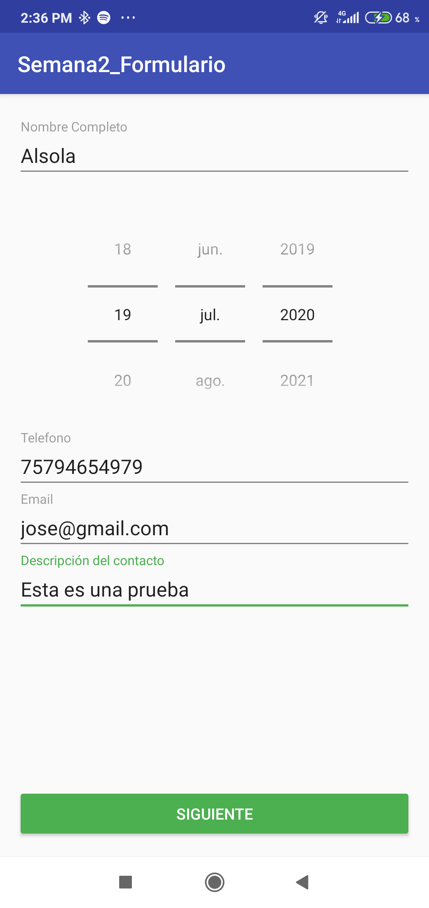
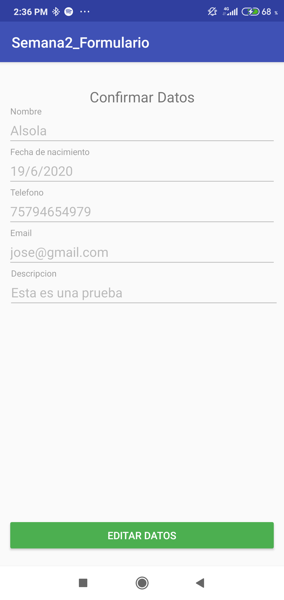
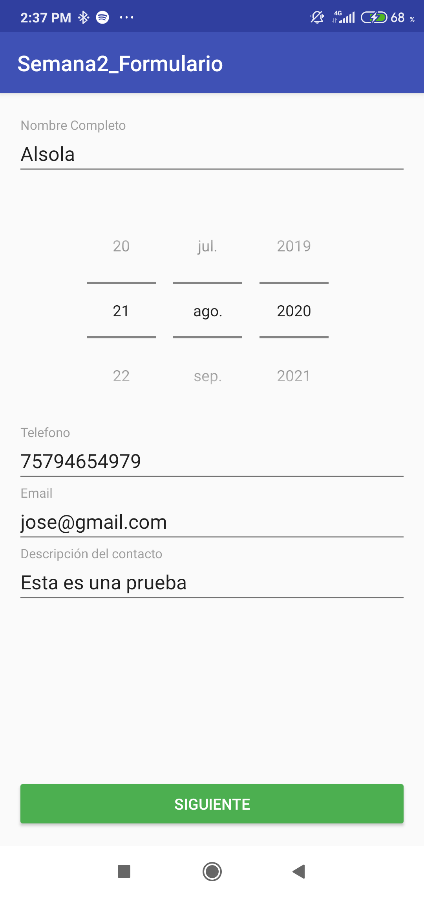

# Semana2_Formulario
En esta practica se presetan dos actividades, la primera encargada de recoger información y en la segunda actividad esta una pantalla que presenta la información extraida de la primera actividad para que confirme los datos. Si hay que editar los datos, esta el botón que permite regresar a la primera actividad con los datos precargados.

